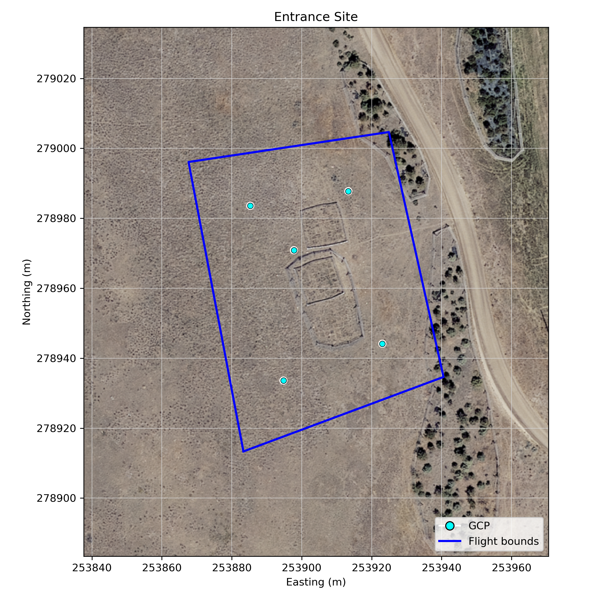
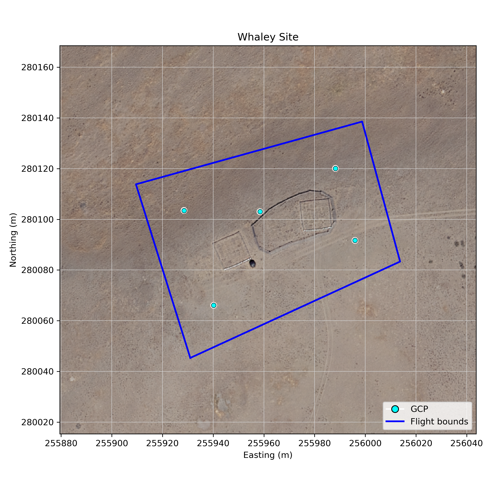

# Exclosure Surveys

This repository contains scripts and data for planning and mapping exclosure surveys. The workflow involves processing Ground Control Points (GCPs), generating KML flight polygons for drone surveys, and creating site maps with GCPs overlaid on aerial imagery.

There five sites, each five GCPs per site. The GCPs are located at the center and corners of each site. We are targetting imaging for the week of June 2nd, 2025.

## Project Structure

```
.
├── 00_make_survey_kmls.py        # Generates KML flight polygons from GCPs
├── 01_make_emlid_init_gcps.py    # Processes GCPs and extracts elevation data
├── 02_map_sites.py               # Creates overview and site-specific maps
├── data/
│   └── vector/
│       └── gcps.geojson          # Input GCP coordinates
├── planning/
│   ├── flight_polygons/          # Output KML flight polygons
│   │   ├── entrance.kml
│   │   ├── gun_range.kml
│   │   ├── indian_ridge.kml
│   │   ├── north_woodchuck.kml
│   │   └── whaley.kml
│   ├── maps/                     # Output map images
│   │   ├── all_sites.png
│   │   ├── entrance_site.png
│   │   ├── gun_range_site.png
│   │   ├── indian_ridge_site.png
│   │   ├── north_woodchuck_site.png
│   │   └── whaley_site.png
│   ├── emlid_init_gcps.csv       # Processed GCPs with elevation for Emlid import
│   └── exclosure_surveys.qgz     # QGIS Project file
└── README.md
```

## Site Maps

Below are examples of the maps generated by this project.

### All Sites Overview


### Individual Site Maps

An individual map is generated for each site. Examples:

**Entrance Site**


**Gun Range Site**


**Indian Ridge Site**


**North Woodchuck Site**


**Whaley Site**


## Terrain Following Data

The `data/raster/fc_dsm_ellipsoidal.tif` file contains the Digital Surface Model (DSM; ellipsoidal height; EPSG 4326) required for DJI's terrain-following feature. All missions will be executed with terrain following enabled.

## Other Mission Specifications

*   **Drone:** DJI Mavic 3 Multispectral
*   **Sensors:** Multispectral and RGB
*   **Shutter speed:** 1/1000s
*   **AGL:** 25m
*   **Terrain following:** TRUE
*   **Buffer margin:** 0m
*   **Front Lap:** 80%
*   **Side Lap:** 70%
*   **Flight Speed:** AUTO
